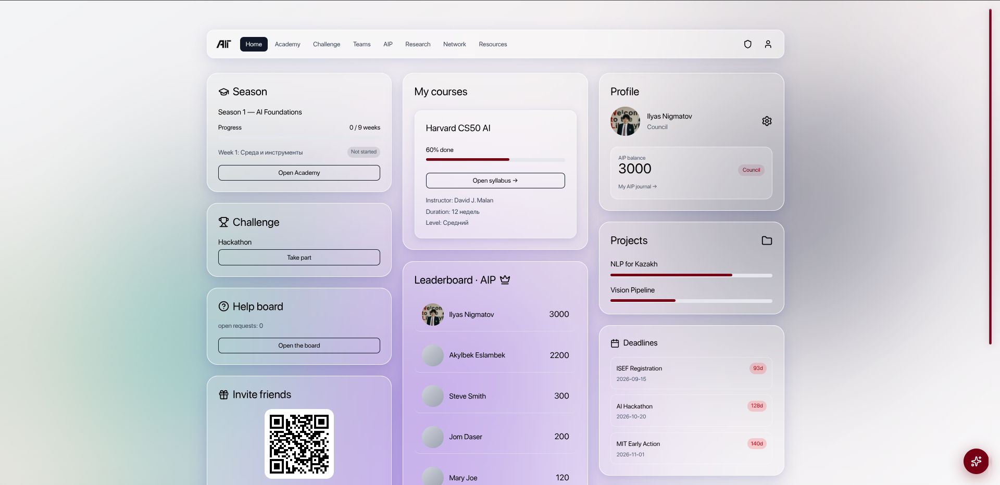
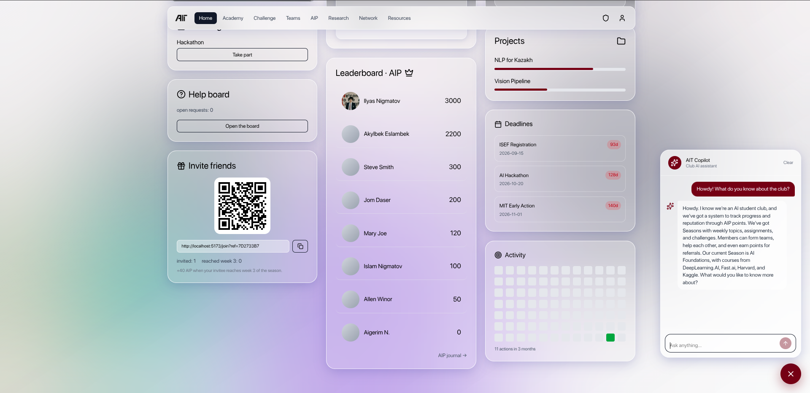

<div align="center">
  

  # AIT Hub

  **The operating system for an AI student club** — Academy seasons, a verified
  reputation system, challenges, teams, an AI copilot, and end-to-end onboarding
  automation driven by self-hosted n8n.

  [Live demo](https://ait-hub.pages.dev) · [Architecture](#architecture) · [AI integration](#ai-integration) · [Automation (n8n)](#automation-n8n) · [Roadmap](ROADMAP.md)

  <sub>React 19 · TypeScript · Vite · Supabase (Postgres + RLS + Edge Functions) · Groq · self-hosted n8n · Cloudflare Pages</sub>
</div>

---

## What it is

AIT Hub is a full-stack community platform. Members apply, get **AI-screened**, are
**provisioned automatically** (auth user + magic-link invite), then learn through weekly
**Academy seasons**, earn **AIP** (reputation points that can only be earned through verified
actions — never self-assigned), compete in **challenges**, form **teams**, and ask an
in-app **AI copilot** grounded in the club's live data.

It is built as three tightly integrated layers — a polished React SPA, a Supabase backend
with hardened row-level security, and a self-hosted n8n automation tier reached only through
an HMAC-signed relay — so it doubles as a reference implementation for **AI integration**,
**full-stack engineering**, and **n8n automation**.

## Screenshots

> Drop captures into [`docs/screenshots/`](docs/screenshots/) — see the [shot list](docs/screenshots/README.md).

| Dashboard (draggable cards) | AIT Copilot (streaming) | Admin triage + automations |
|---|---|---|
|  |  |  |

## Highlights

- **AI copilot, streamed end to end.** A JWT-gated Supabase Edge Function calls Groq and
  pipes the SSE stream straight to the browser, token by token, grounded in the club's live
  data (active season + course catalogue). The API key never leaves the server.
- **AI application screening + auto-provisioning.** A new application fires a DB webhook →
  signed relay → n8n: the model scores the applicant; on accept, n8n creates the auth user,
  generates a magic-link invite, and emails it (with a Telegram fallback when no email domain
  is verified).
- **A reputation system that can't be gamed.** AIP is awarded only by verified server-side
  actions; AI-generated profile scores are written with the service role and frozen by a DB
  trigger so members can't self-assign them.
- **Hardened Postgres.** Row-level security on every table, a custom access-token hook that
  injects the member's role as a JWT claim, `security definer` functions pinned with
  `set search_path = ''`, and pgTAP tests for RLS, idempotency, and XP awards.
- **A real automation tier.** Self-hosted n8n in **queue mode** (main + worker + Redis +
  Postgres), reached only through an HMAC-signed relay with replay protection — the browser
  never talks to n8n directly.
- **A dashboard you can rearrange.** Drag-and-drop, per-member persisted layout (dnd-kit),
  glassmorphism UI, Framer Motion transitions, and RU/EN i18n.

## Architecture

```
                ┌─────────────────────────────────────────────┐
   Browser ───▶ │  React 19 SPA (Vite, TypeScript)            │
                │  React Router · TanStack Query · Context     │
                └───────────┬─────────────────────┬───────────┘
                            │ supabase-js          │ fetch (member JWT)
                            ▼                       ▼
                ┌──────────────────────┐   ┌────────────────────┐
                │  Supabase (managed)  │   │  Supabase Edge Fns │
                │  Postgres + RLS      │◀──│  ai-chat (Groq SSE)│
                │  Auth · Storage      │   │  profile-score     │
                │                      │   │  trigger-workflow  │
                └──────────┬───────────┘   │  (JWT → HMAC sign) │
                           ▲               └─────────┬──────────┘
                           │ service-role            │ HMAC-signed webhook
                           │ writes                  ▼
                           │                ┌───────────────────────┐
                           └────────────────│  n8n (self-hosted)    │
                                            │  queue mode + Redis    │
                                            │  + Postgres + tunnel   │
                                            └───────────────────────┘
```

**Trust boundary:** the browser holds only the public anon key. The Groq key, the n8n webhook
secret, and the Supabase service-role key live exclusively server-side. Everything that
reaches n8n goes through `trigger-workflow`, which authenticates the caller, HMAC-signs the
payload, and forwards it; n8n verifies the signature and rejects stale timestamps (replay
protection).

## Tech stack

| Layer | Tech |
|---|---|
| Frontend | React 19, TypeScript, Vite 7, Tailwind CSS 4, Framer Motion, dnd-kit, TanStack Query, React Router 7 |
| Backend | Supabase — Postgres, Row-Level Security, Auth, Storage, Edge Functions (Deno) |
| AI | Groq (OpenAI-compatible, streaming) — provider-agnostic by base URL/model |
| Automation | Self-hosted n8n (queue mode: main + worker + Redis + Postgres), Caddy / Cloudflare Tunnel |
| Delivery | Cloudflare Pages (SPA), GitHub Actions CI (lint + typecheck + pgTAP), Sentry |

## AI integration

Two Edge Functions, both JWT-gated, both keeping the provider key server-side:

- **[`ai-chat`](supabase/functions/ai-chat/index.ts)** — the AIT Copilot. Verifies the
  member's JWT, grounds the prompt in live club data, then streams a Groq completion back as
  SSE. The browser ([`aiChat.ts`](src/lib/aiChat.ts)) reads the stream token by token.
- **[`profile-score`](supabase/functions/profile-score/index.ts)** — structured JSON
  assessment of a member's profile; the score is written with the **service role** so it
  can't be self-assigned.

Provider-agnostic by design: Groq is OpenAI-compatible, so moving to another provider is a
base-URL + model swap. See [`supabase/functions/README.md`](supabase/functions/README.md).

## Automation (n8n)

Self-hosted n8n orchestrates onboarding and provisioning. The browser never calls n8n — it
goes through the signed relay:

```
React (member JWT) ─┐
                    ├─▶ trigger-workflow (auth → HMAC sign) ─▶ n8n (verify HMAC + timestamp)
applications INSERT ┘   (DB webhook, x-internal-key)
```

- **`onboarding`** — applicant is AI-scored; admins are notified.
- **`onboarding-accept`** — on accept, n8n creates the auth user, generates a magic-link
  invite, and delivers it via Resend (email) or Telegram (fallback), then marks the
  application provisioned.
- **`error-handler`** — captures failures to an `automation_errors` table.

Full setup (queue mode, security model, local home-hosting via Cloudflare Tunnel) is in
[`infra/n8n/README.md`](infra/n8n/README.md).

## Getting started

Requires Node 22 (see [`.nvmrc`](.nvmrc)).

```bash
npm install
cp .env.example .env.local      # set VITE_SUPABASE_URL + VITE_SUPABASE_ANON_KEY
npm run dev                      # http://localhost:5173
```

Other scripts:

```bash
npm run build       # type-check + production build
npm run lint        # ESLint
npm run typecheck   # tsc -b
npm run n8n         # bring up the local n8n stack (Docker) + Cloudflare tunnel
```

Backend pieces:

- **Database** — migrations in [`supabase/migrations/`](supabase/migrations/); push with
  `npm run db:push`. pgTAP tests in [`supabase/tests/`](supabase/tests/) (`npm run test:db`).
- **Edge Functions** — [`supabase/functions/`](supabase/functions/); deploy per that folder's README.
- **Automation** — [`infra/n8n/`](infra/n8n/).

## Deployment

The SPA ships to **Cloudflare Pages** on every push to `main`; PRs get preview deploys. Step
by step in [`DEPLOY.md`](DEPLOY.md). The roadmap and architecture decisions are in
[`ROADMAP.md`](ROADMAP.md).

## License

MIT © knbww — see [`LICENSE`](LICENSE).
